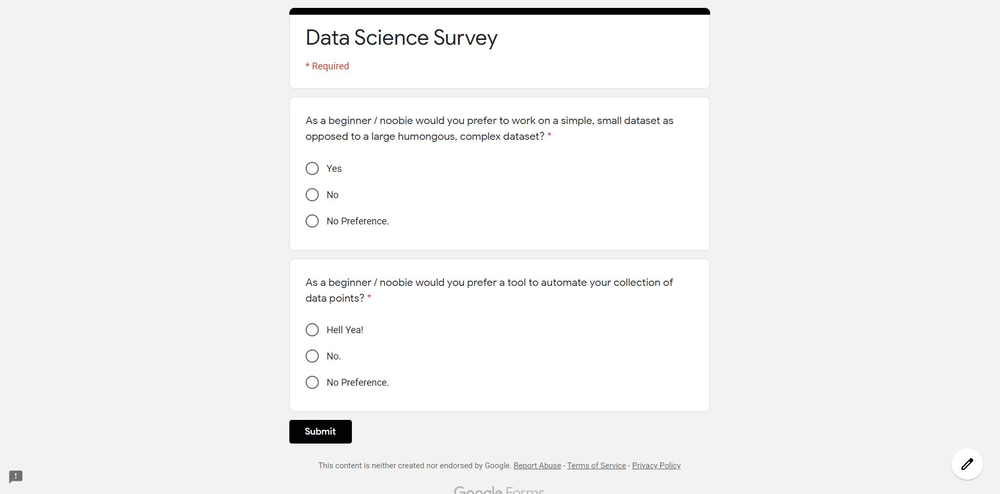

# Google-Form-Bot

Uses Selenium to automate responses for [this google form.](https://forms.gle/X6uCejPE7qwhWnm99)

----------------------------------------------------------------------------------------------------------------------------------------

* bot.py - Uses 3 functions, for yes, no and no preference and automates it in a loop.

* botv2.py - Uses 3 pre-filled urls, and fetchs each url randomly and submits it.

----------------------------------------------------------------------------------------------------------------------------------------

----------------------------------------------------------------------------------------------------------------------------------------

#### [Link to an article about this.](https://medium.com/@ashishamar1999/cc059ad1a2c5?source=friends_link&sk=78bf66fd0f1a9251095c2877ec3ccb73)

----------------------------------------------------------------------------------------------------------------------------------------
